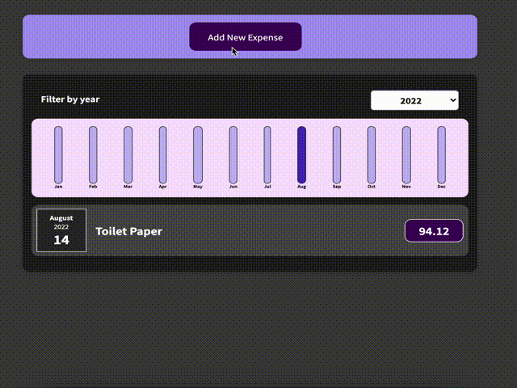

# Learning REACT JS concepts by doing various projects.

## 1. Meet-up app

This project is a part of react course - https://acad.link/reactjs  
Code reference - https://github.com/academind/react-complete-guide-code/tree/zz-reactjs-summary

## 2. Expense tracker app

